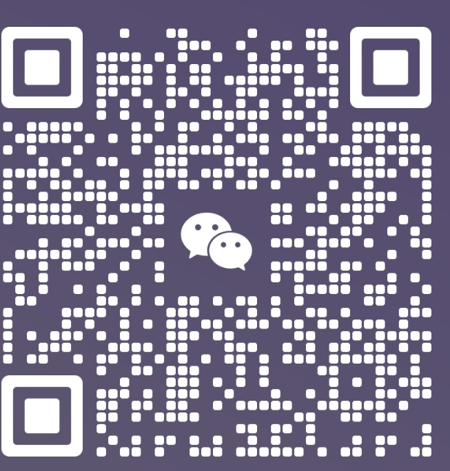

# ala-travle-website

## 项目背景

此项目是大一课程设计项目，所使用的技术：`HTML+CSS` ，实现和设计了一个亲子旅游网站

## 项目介绍

见课程设计报告-大李子.doc

## 我的博客

[爱编程的大李子](https://blog.csdn.net/LXYDSF/)

## 交流合作

- VX：LXY18697793203

- QQ：2422737092